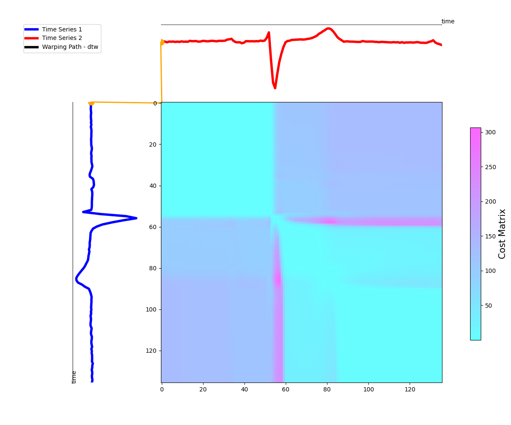
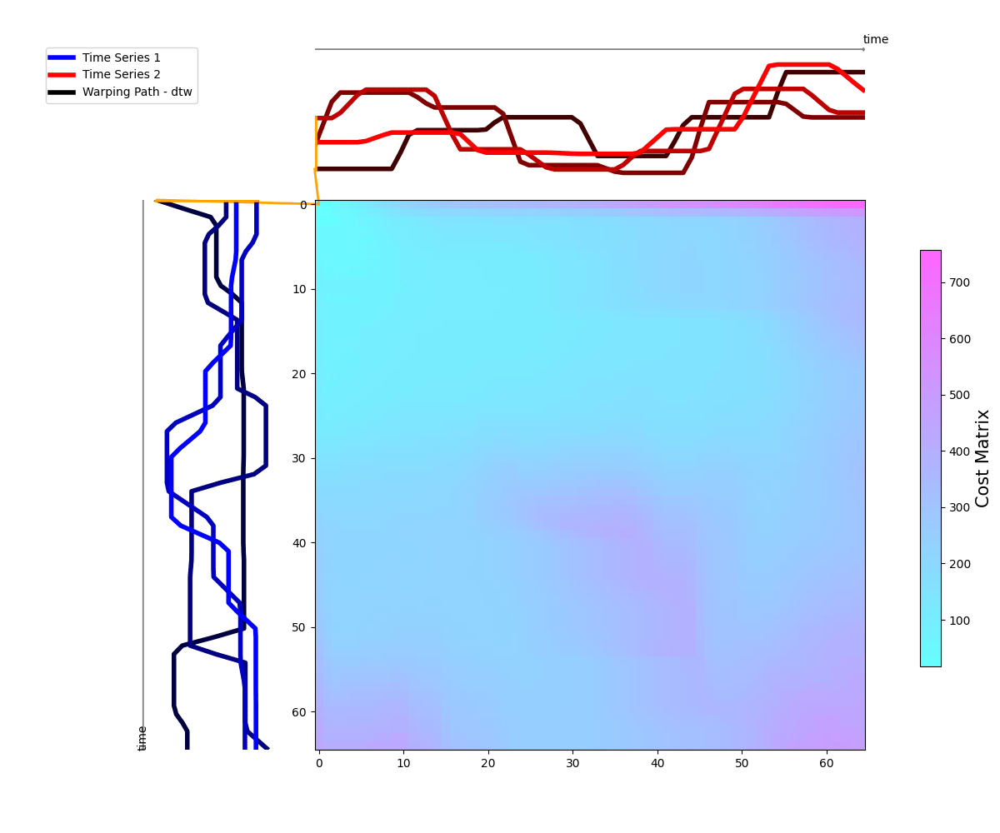

# Elastic Warping Visualization For Time Series

## Author

- **Ali Ismail-Fawaz** ([hadifawaz1999](https://github.com/hadifawaz1999))

This repository contains a project for visualizing warping distortions such as the ones produced by Dynamic Time Warping (DTW) between two time series. The project includes functions to generate plots and animated MP4s showcasing the alignment between the series. The repository is configured using [Hydra](https://hydra.cc/docs/intro/) for flexible and organized parameter management, and [aeon-toolkit](https://www.aeon-toolkit.org/en/stable/) for all time series processing and similarity measure calculation.

## Contents

- `main.py`: The main script to run the DTW visualization.
- `draw_functions.py`: Contains the functions for generating plots and MP4s.
- `utils.py`: Utility functions used in the project.
- `config/config_hydra.yaml`: Configuration file for Hydra.


## Usage

### PyPi Package

Simply install the package as such `pip install elastic_warping_vis` and then use it as follows:
```Python
from elastic_warping_vis.utils import load_data
from elastic_warping_vis.draw_functions import draw_elastic_gif, draw_elastic

# ignore third output, used for dev version
X, y, _ = load_data(name="ECG200", split="train", znormalize=True)
draw_elastic(x, y, metric="dtw")
draw_elastic_gif(x, y, metric="dtw")

```

### Prerequisites

- Python >= 3.10
- Required Python libraries:
    - `numpy==1.26.4`
    - `matplotlib==3.9.0`
    - `hydra-core==1.3.2`
    - `aeon==0.10.0`
- Required on the system:
    - `ffmpeg` version `4.4.2`

### Running the Code

1. Configure the parameters in `config/config_hydra.yaml` as needed.
2. Run the main script:
    ```sh
    python3 main.py
    ```

### Configuration Parameters

The following parameters can be configured in the `config/config_hydra.yaml` file:

- **Hydra Configuration:**
  - `hydra.job.name`: Name of the job (default: `dtw-vis`).
  - `hydra.run.dir`: Directory to save experiment results (default: `exps/${hydra.job.name}`).

- **General Parameters:**
  - `output_dir`: Directory where output plots and MP4s will be saved (default: `./`).
  - `dataset`: Name of the dataset to use (default: `ItalyPowerDemand`) loaded from aeon-toolkit, see the [classification dataset list](https://github.com/aeon-toolkit/aeon/blob/main/aeon/datasets/tsc_datasets.py) and the [regression datasets list](https://github.com/aeon-toolkit/aeon/blob/main/aeon/datasets/tser_datasets.py), works with both univariate and multivariate time series datasets.
  - `split`: Dataset split (default: `None`).
  - `znormalize`: Whether to Z-normalize the time series (default: `True`).
  - `class_x`: Class label for the first time series (default: `0`).
  - `class_y`: Class label for the second time series (default: `1`).
  - `show_warping`: Whether to show warping connections in the plot (default: `False`).
  - `figsize`: Figure size for the plots (default: `[12, 10]`).

- **Metric Parameters:**
  - `metric`: Metric used for elastic warping calculation (default: `dtw`), see [aeon's list of elastic measures](https://www.aeon-toolkit.org/en/stable/api_reference/distances.html).
  - `metric_params`: Additional parameters for the DTW metric, including:
    - `window`: Window size for the Sakoe-Chiba band (default: `None`).
    - `p`: Parameter for p-norm (default: `2.0`).
    - `w`: Window size (default: `None`).
    - `itakura_max_slope`: Maximum slope for Itakura parallelogram (default: `None`).
    - `descriptor`: Descriptor function (default: `identity`).
    - `reach`: Reach parameter (default: `5`).
    - `g`: Parameter for derivative DTW (default: `0.05`).
    - `epsilon`: Epsilon parameter for soft-DTW (default: `1.0`).
    - `g_arr`: G array for derivative DTW (default: `None`).
    - `nu`: Regularization parameter for shape-based DTW (default: `0.001`).
    - `lmbda`: Regularization parameter for penalized DTW (default: `1.0`).
    - `independent`: Whether to use independent feature DTW (default: `True`).
    - `c`: Regularization parameter for elastic shape DTW (default: `1.0`).
    - `warp_penalty`: Penalty for warping path length (default: `1.0`).
    - `standardize`: Whether to standardize the time series before DTW (default: `True`).

<!-- ## Example

Using DTW on [ECGFiveDays](http://timeseriesclassification.com/description.php?Dataset=ECGFiveDays) univariate dataset

- In video format [download-here](exps/dtw-vis/ECGFiveDays/dtw.mp4): 
- In pdf format: [dtw-italy-pdf](exps/dtw-vis/ECGFiveDays/dtw.pdf)

Using DTW on [ERing](http://timeseriesclassification.com/description.php?Dataset=ERing) multivariate dataset

- In video format [download-here](exps/dtw-vis/ERing/dtw.mp4): 
- In pdf format: [dtw-italy-pdf](exps/dtw-vis/ERing/dtw.pdf) -->

## Citation

If you use this code in your research, please cite this repository:

```bibtex
@misc{ismail-fawaz2024elastic-vis,
  author       = {Ismail-Fawaz, Ali and Devanne, Maxime and Berretti, Stefano and Weber, Jonathan and Forestier, Germain},
  title        = {Elastic Warping Visualization For Time Series},
  year         = {2024},
  publisher    = {Github},
  journal      = {GitHub repository},
  howpublished = {\url{https://github.com/yourusername/dtw-visualization}}
}
```

## Acknowledgments

We would like to thank the authors of the UCR, UEA and Monash archives for making the Time Series Classification/Regression datasets publicly available.
We would also like to thank the Aeon time series machine learning python toolkit for their fast implementation of elastic similarity measures.
